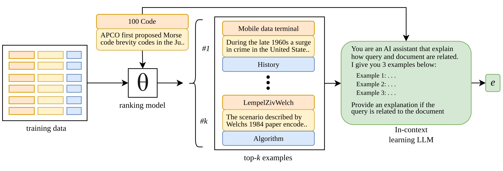

# Rank-ICL: Ranking-based In-context Learning for Search Results Explanations Improvement

This repository provides code to generate **query–document relevance explanations** using large language models (LLMs), supporting **zero-shot**, **few-shot**, and **Rank-ICL** settings.



---

## Quick Start

### 1. Install
```bash
pip install -r requirements.txt
```

### 2. Run
```bash
python -m run_generate.py [ARGS]
```

### 3. Example
```bash
python -m run_generate.py \
  --hf-token YOUR_TOKEN \
  --dataset wiki \
  --test-size 2000 \
  --samples 3 \
  --function sbert \
  --prompt rag \
  --model meta-llama/Meta-Llama-3-8B-Instruct \
  --top-p 0.8 --top-k 10 --temp 0.1 \
  --max-tokens 100 --penalty 1.0 \
  --output outputs/wiki_rag_sbert.csv
```

## WikiSA dataset
Code to construct WikiSA dataset are availabe at directory data/wikisa/

## Output
Each run generates:
- CSV output (--output) with reference and generated explanations
- Metrics log appended to experiment_results.csv

## Citation
```bibtex
@inproceedings{rank-icl2026,
  title={...},
  author={...},
  year={2026}
}
```
