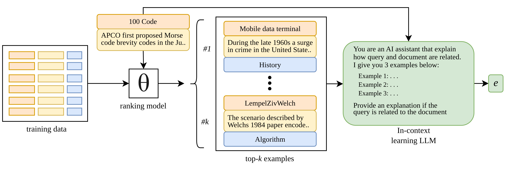

# Rank-ICL: Ranking-based In-context Learning for Search Result Explanation

This repository provides code to generate **query–document relevance explanations** using large language models (LLMs), supporting **zero-shot**, **few-shot**, and **Rank-ICL** settings.



---
### Abstract
Explanations in search results typically consist of text snippets or short passages presented alongside retrieved documents to help users efficiently assess relevance. 
Rather than relying on randomly chosen demonstrations, relevant examples are dynamically retrieved based on retrieval functions to the input query–document pair.
Evaluation on WikiSA and ExaRank shows that ranking-based few-shot prompting generally improves over zero-shot prompting and achieves competitive performance against random-shot prompting. However, its effectiveness varies across datasets, indicating that retrieval-based demonstration selection is beneficial but not uniformly superior in all settings.


## Quick Start

### 1. Install
```bash
pip install -r requirements.txt
```

### 2. Run
```bash
python -m run_generate.py [ARGS]
```

### 3. Example
```bash
python -m run_generate.py \
  --hf-token YOUR_TOKEN \
  --dataset wiki \
  --test-size 2000 \
  --samples 3 \
  --function sbert \
  --prompt rag \
  --model meta-llama/Meta-Llama-3-8B-Instruct \
  --top-p 0.8 --top-k 10 --temp 0.1 \
  --max-tokens 100 --penalty 1.0 \
  --output outputs/wiki_llama_sbert.csv \
  --metrics-log logs/wiki_llama_sbert.csv \
```

## WikiSA dataset
Code to construct the WikiSA dataset is available at the directory `data/wikisa/`

## Output
Each run generates:
- CSV output (--output) with reference and generated explanations
- Metrics log (--metrics-log) evaluate using ROUGE-1, METEOR, BERTScore metrics

<!-- ## Citation
```bibtex
@inproceedings{rank-icl2026,
  title={...},
  author={...},
  year={2026}
}
``` -->
